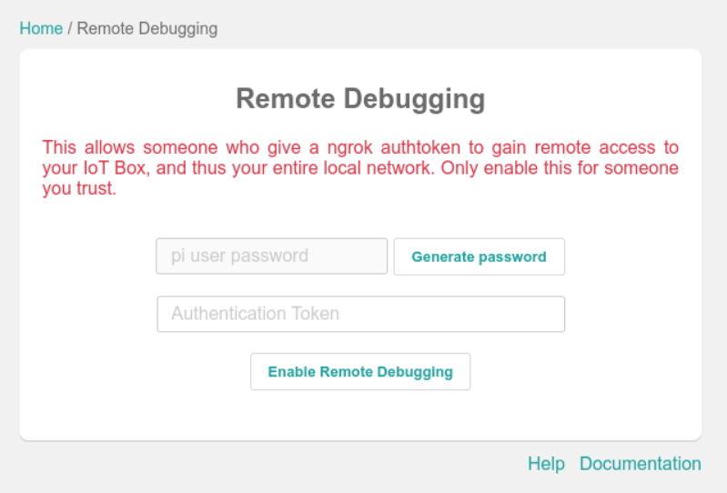

==========================
Connect an IoT box via SSH
==========================

.. |iot| replace:: :abbr:`IoT (Internet of Things)`
.. |SSH| replace:: :abbr:`SSH (secure shell protocol)`

To connect an Internet of Things (IoT) box via an |SSH| connection, a password needs to be
generated.

First, navigate to the :menuselection:`IoT app --> IoT Boxes`. Click on the IP address of the
appropriate |iot| box.

.. note::
   If the desired |iot| box does not appear, see :doc:`troubleshooting` for additional steps.

At the bottom of the |iot| box pop-up window, click :guilabel:`Remote Debug`. This opens the
:guilabel:`Remote Debugging` pop-up window.

.. danger::
   After the password has been generated from the :guilabel:`Remote Debugging` pop-up window, the
   information **must** be recorded immediately. Once this window is closed, there is no current
   method for looking up this information.

.. seealso::
   - :doc:`connect`
   - :doc:`troubleshooting`
   - :doc:`updating_iot`

