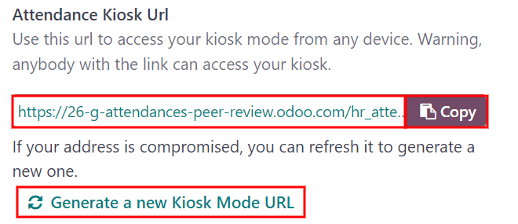

======
Kiosks
======

Odoo's *Attendances* app allows employees to check in and out of work either directly from the
database, or from a kiosk. Since only employees who have access to the database (referred to as
users) can check in and out from the database, kiosks are needed for employees who do **not**
have access to the database (are **not** users).

A kiosk is a dedicated device (a PC, tablet, or mobile phone) for employees to check in and out
from.

.. important::
   If employees check in and out using either a badge or an RFID, then an accessible device in
   kiosk mode **must** be available to use these two methods.

Configuration
=============

Few configurations are needed in the *Attendances* application to use kiosks. Navigate to
:menuselection:`Attendances app --> Configuration` to access the configuration menu.

.. _attendances/kiosk-mode:

Kiosk mode
----------

Using the drop-down menu, select how an employee checks in when using a kiosk. Options are
:guilabel:`Barcode/RFID`, :guilabel:`Barcode/RFID and Manual Selection`, or :guilabel:`Manual
Selection`.

.. important::
   The *Barcode* application **does not** need to be installed to use one of the Barcode/RFID
   settings.

.. _attendances/kiosk-settings:

Kiosk settings
--------------

The various settings in the :guilabel:`Kiosk Settings` section determines how employees check in
and out with kiosks.

- :guilabel:`Barcode Source`: this setting appears **only** if either of the two Barcode/RFID
  selections were configured for the :ref:`Kiosk Mode <attendances/kiosk-mode>` setting. Select how
  barcodes are scanned at the kiosk, either with a dedicated barcode :guilabel:`Scanner`, or the
  device's :guilabel:`Front Camera`, or :guilabel:`Back Camera`.
- :guilabel:`Employee PIN Identification`: activate this option if employees should use a unique PIN
  to check in. PINs are configured on each individual employee record. Refer to the
  :doc:`../employees/new_employee` documentation for more information on setting up PINs.
- :guilabel:`Display Time`: set the duration (in seconds) the check in and check out confirmation
  screen remains on the kiosk before going back to the main check in screen.
- :guilabel:`Attendance Kiosk Url`: Odoo generates a unique web address (URL) to use a device as a
  kiosk without having to sign in to the Odoo database. When setting up a kiosk device, navigate to
  this unique web address in a web browser to present the Attendances application kiosk.

  .. important::
     These kiosk URLs are **not** secured with any type of access code. Anyone who has the URL can
     access the Attendances application kiosk. If the URL is compromised for any reason, such as in
     the event of a security breach, click :guilabel:`Generate a new Kiosk Mode URL`, located
     beneath the link, to generate a new URL and update the kiosk accordingly.

Kiosk mode
==========

Entering kiosk mode is only available for users with specific :ref:`access rights
<attendances/access-rights>`.

Kiosk mode can be activated in three different ways:

#. Navigate to the :guilabel:`Attendances` application, and click :guilabel:`Kiosk Mode` in the top
   menu. The device then enters kiosk mode.
#. Navigate to the :menuselection:`Attendances application --> Configuration`. In the
   :guilabel:`Kiosk Settings` section, click on the link in the :guilabel:`Attendance Kiosk Url`
   field. A new tab opens in kiosk mode. It is recommended to close the database tab to keep the
   database secure.
#. Navigate to the :menuselection:`Attendances application --> Configuration`. In the
   :guilabel:`Kiosk Settings` section, click :guilabel:`Copy` next to the link beneath the
   :guilabel:`Attendance Kiosk Url` field. Paste this URL into a web browser on the kiosk device and
   navigate to it.

As a security measure, once a device is in kiosk mode, it is not possible to exit kiosk mode and go
back into the database without signing back in. To exit kiosk mode, click the back button in the web
browser. This logs the user out of the database, and returns to the main log in screen. This adds an
extra layer of security, preventing anyone from accessing the database.

.. _attendances/kiosk-mode-entry:

Check in and out with a kiosk
=============================

Badge
-----

To check in or out using a badge, tap the :icon:`fa-camera` :guilabel:`Tap to scan` image in the
center of the kiosk.

Then, scan the barcode on the badge using the method configured in the :ref:`kiosk settings
<attendances/kiosk-settings>` section of the configuration menu. Options are a dedicated barcode
scanning device, or the kiosk's front or back camera.

Once the barcode is scanned, the employee is checked in or out, and a :ref:`confirmation message
<attendances/confirmation>` appears with all the check in or check out information.

RFID
----

To check in or out using an RFID key fob, simply scan the fob with an RFID reader.

Once scanned, the employee is then either checked in or checked out, and a :ref:`confirmation
message <attendances/confirmation>` appears with all the check in or check out information.

Manually
--------

Users who do not have a scannable badge or an RFID fob can manually check in and out at a kiosk.

Tap the :guilabel:`Identify Manually` button on the kiosk, and a screen with all the employees that
can be checked in or out appears. This is the same view as in the *Employees* application dashboard.

Tap on the person, and they are either checked in or checked out, and a :ref:`confirmation message
<attendances/confirmation>` appears.

When a large number of employees appear in the list, making scrolling inefficient, there are two
ways to quickly find a specific person:

- :guilabel:`Search...`: tap on the :guilabel:`Search...` field and enter the person's name. As the
  name is typed in, the matching results are displayed on the screen.
- :guilabel:`Department`: to quickly filter the presented employees, tap on a department to display
  only those employees that are part of that department. The :guilabel:`Departments` are listed on
  the left side of the screen, and the number at the end of each department indicates how many
  employees are part of the department, and is displayed when selected.

PIN
~~~

If the :guilabel:`Employee PIN Identification` option was activated in the :ref:`kiosk settings
<attendances/kiosk-settings>` section of the configuration menu, the employee is prompted to enter a
PIN when manually checking in or out.

After the employee is selected, a number pad appears with a message. When checking in,
:guilabel:`(Employee) Welcome! Please enter your PIN to check in` appears above the numbers. When
checking out, :guilabel:`(Employee) Want to check out? Please enter your PIN to check out` appears
above the numbers.

Tap in the PIN using the number pad, then tap :guilabel:`OK` when done. The employee is then checked
in or out, and a :ref:`confirmation message <attendances/confirmation>` appears.

.. image:: kiosks/enter-pin.png
   :align: center
   :alt: The pop-up that appears when prompted to enter a pin.

.. _attendances/confirmation:

Confirmation message
--------------------

When an employee checks in or out, a confirmation message appears with all the check in or check out
information. When checking in, a welcome message appears, as well as the date and time of check in.

An :guilabel:`Hours Previously Today: HH:MM` field also appears, displaying any time already logged
for that employee for the day. If no time has already been logged, the value displayed is `00:00`.
Beneath the message is an :guilabel:`OK` button.

To exit the screen before the preset time in the kiosk, tap the :guilabel:`OK` button.

When checking out, the screen displays a goodbye message, with the date and time of check out, and
the total hours logged for the day. Beneath the message is a :guilabel:`Goodbye` button. To exit the
screen before the preset time, tap the :guilabel:`Goodbye` button.

.. image:: kiosks/goodbye-message.png
   :align: center
   :alt: The goodbye message with all the employee's check out information.
