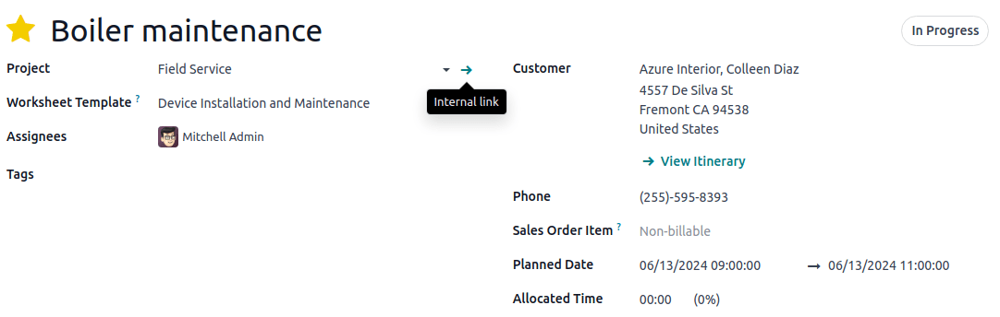

===================
Worksheet Templates
===================

**Worksheets** help your field service workers perform and report the tasks they do on site.
They can feature various information, such as instructions, to-do lists, etc. You can
also format your worksheet using checkboxes, bullet points, blank fields to fill in, HTML, and add
files, images, links, and more.

Because it is common for businesses to have their workers perform the same type of field service
repeatedly, Odoo offers the option to create custom **Worksheet Templates**. By doing so, you
don’t have to create the same worksheet every time you plan the same type of field service task.

Configuration
=============

To use **worksheets** in **Field Service**, the **Worksheet Template** feature must be enabled
first. Go to :menuselection:`Field Service --> Configuration --> Settings --> Worksheet Templates`

Create a Worksheet Template
===========================

To create your **worksheet templates**, go to :menuselection:`Field Service --> Configuration -->
Worksheet Templates`. Click :guilabel:`New`, give your worksheet template a name, then click
:guilabel:`Design Template`. Doing so will open the **Studio**.

.. important::
   Clicking :guilabel:`Design Template` will automatically install the **Studio** app in your
   database, which is required to design worksheet templates. Adding more apps to your database may
   impact your price plan.

In the Studio click :guilabel:`Add`. Drag and drop the items that you want from the left column
into your worksheet. To rearrange the items, just drag and drop them in the order that you want.
Click on the items you added to your worksheet to customize their properties.

When your Worksheet Template is complete, click :guilabel:`Close` in the top right corner of the
page to leave **Studio**.

Add a Worksheet Template to a Field Service task
================================================

Go to your Field Service task and select a :guilabel:`Worksheet Template`. Remember that the
:guilabel:`Task Title` and :guilabel:`Customer` fields are mandatory. Click :guilabel:`Save`.

Assign a default Worksheet Template
===================================

If you have configured multiple Worksheet Templates, you can select one to be set up by
default when you create a new Field Service task. Go to your task, drag your mouse over the name of
your project to make the green arrow and the **internal link** tab appear, click on it.

Then click
on the :guilabel:`Settings` tab. Under **Field Service**, make sure the :guilabel:`Worksheet`
checkbox is ticked and select the :guilabel:`Worksheet Template` you want to set up as default.
:guilabel:`Save` your changes.

Use worksheets on site
======================

Field service workers can complete the worksheet to document the work they are doing on site. Go to
your :guilabel:`Task` and click the :guilabel:`Worksheet` Smart Button. Fill the blank fields
and :guilabel:`Save`.

.. note::
   - As soon as you save a worksheet, the appearance of the **Worksheet** smart button on
     your task will change and display **Worksheet Complete** instead, regardless some fields are
     left blank.
   - Any field set up as **required** has to be filled for a worksheet to be saved.
